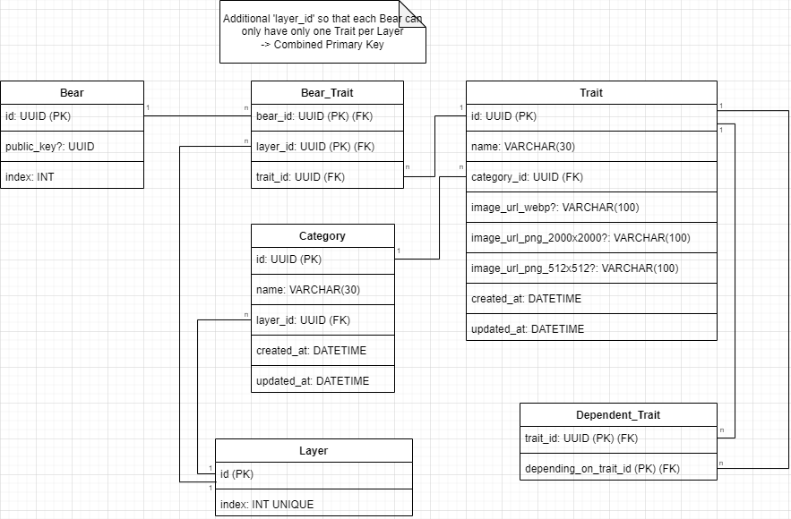
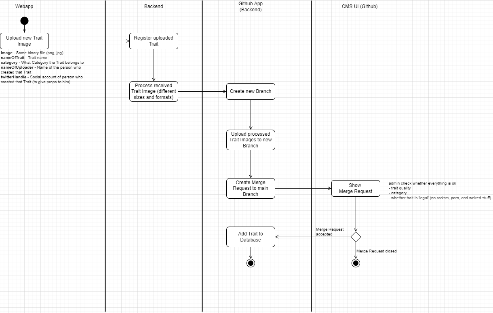

# 🐻👕 `Dressing Room`

> [Project definition](https://docs.google.com/document/d/1r79JpQuDaUg7jHCuk29znx-eFeEVWszP1QbT7YaIZR4/edit)

This is the backend project for the `Dressing Room` project.

#### 🕐 Time spent building this project

---

### Modules
- `backend` - The backend where the code lives.
- `devops` - All relevent files for deployment and running the App on a server.
- `docs` - Some documentation. (wip)
- `resources` - Files that are relevant for documentation purpose and planning.

---

## 🛠 Local Development

todo

---

## 📬 Deployment

todo

---

## 🦾 Database

We've decided to use a `Relational Database` (PostgreSQL). Why because it's fast, scalable and we are most comfortable with it.

### Database Requirements

- Store default `traits` (including Background, Fur, Mouth, Eyes, Hat, Clothes, Eyewear) with `Bear Number` (e.g. #7227) and corresponding `public key` for each Bear (Primary key should be `public key`)
- `Public key` to fetch additional data from blockchain and keep attributes in sync (e.g. with cronjob)
- Each Bear can have **one TRAIT for each default CATEGORY**
- Attributes consist of `image urls` (different sizes and formats for different use cases → download, frontend compositions), a `unique id` (referenced in the image link), a name (e.g. yellow) and a `category id` (Primary key should be `unique id`)
- Each **trait belongs to ONE category** and can be assigned to x Bears
- Categories consist of a `name`, a `weight` (to decide which category is added to the layer at what position) and a `unique id` (Primary key should be `uniqe id`)

### Concept

v1

---

## 🔩 Content Management System (`CMS`)

In term of management, we’ll need a CMS that permits us to easily add/remove and edit Traits.
Also do we want to have the option to approve from community members submitted traits before adding them to the Dressing Room.

### Concept

v1

### Github as `CMS`?
GitHub is a hosting service for software development and version control using Git. However, temporary, it can be 'misused' as Content Management System (CMS) for the first iteration of this (POC) backend. A central part of the GitHub are `Pull Requests` and `Issues`. Both of these functionalities come into play in the CMS.

- `Pull Requests` let you tell others about changes you've pushed to a branch in a repository on GitHub. This functionality can be used for the Trait image submission process. As soon as a user submits a new Trait, a `Pull Request` is opened by the backend ([Github App](https://docs.github.com/en/developers/apps/getting-started-with-apps/about-apps)) and an admin can check whether the suggested changes (the newly added image and chosen Category) are appropriate. If the Trait corresponds with the Guidelines, the `Pull Request` can be merged and the changes get applied by the backend. If the Trait doesn't fit, an admin can update/correct the provided changes or close the `Pull Request`.  If the `Pull Request` is closed, the changes won't get applied.
- `Issues` let you track your work on GitHub and can be seen as tasks. Issues are like Task Items a developer has to resolve. Thus, an Issue can be used to define tasks for the backend and not the developer has to resolve the task but the backend. For example, an admin creates a new `Issue` with the Tag `add_category` and defines based on a predefined template the new Category. As soon as the Issue is submitted (e.g. via Tag `apply`) the backend reads the specified information from the Issue and implements these changes.

By using Github we avoid implementing a custom authentication system as a Github Repository has integrated authentisation and admins can be granted the required managment rights.
In the future we might design and build a custom CMS platform that purley serves the purpose of managing the Trait content.

### Rate Limiting of Github API
The [rate limit per hours is `5k` requests](https://docs.github.com/en/developers/apps/building-github-apps/rate-limits-for-github-apps) which is more than enough.

---

## 🖼 Image Hosting

The Trait-Assets have to be accessable from the backend as well as from the frontend.
The backend needs the capability to dynamically add, edit and remove Trait-Assets from the said storage.

### Concept

v1

### Github as `Image Host`?
Github can also be temporarily misused as image host. However its very restricted in terms of scalability as it has a soft limit of `1GB` and hard limit of `5GB` overall storage capazity.
Thus its not the best option in the long run but the best option for the short run,
as its easy to setup and integrates with our `CMS` system.

### Size limit of Github Repo
The [max file size is `100MB`](https://docs.github.com/en/repositories/working-with-files/managing-large-files/about-large-files-on-github#file-size-limits) and [the max repo size is 5GB](https://docs.github.com/en/repositories/working-with-files/managing-large-files/about-large-files-on-github#repository-size-limits). The only limiting facctor might be the **max repo size** as its not scalable. However it should be enough for now. If we assume each trait with the differen scaling factors requires `2MB` we could store `2500` Traits. The base Okay Bear collection [has `171` Traits](https://raritysniper.com/okay-bears/traits).

**Ressources**
- [Stackoverflow](https://stackoverflow.com/questions/23843721/can-github-be-used-for-hosting-files-mp3-and-images)
- [Git Large File Storage](https://git-lfs.github.com/)
- [Git Sizer](https://github.com/github/git-sizer)

### Alternatives
We will built the backend plugin and play and have an `Image Upload Handler` so we can easily swap the Image Hosting Provider in case we run into any issues. Here are some considerable alternatives:
- Google Drive
- AWS (not free)

---

## 🧐 FAQ

### Why we've decided to use GraphQL and REST combination?

1. **Client-side data shaping + Navigating a relational Graph**
   _e.g. Frontend can decide whehter it only requires the Trait ID's of a Bear or all Trait Information already baked into the Response -> only one request instead of potential 2 as we would only return the Trait ID's via the REST API; Easier support for multipe display languages -> Frontend can decide what language the display name of a Trait should be_

2. **Auto documentation + Types for the Backend and Frontend.** Wouldn't be a problem with REST either if we could've figured out how to generate Backend Types (Typescript) based on the created `Open API` file. In Spring Boot its easy but we decided to go with NodeJs + Express for simplicity as the majority devs knows how to write Typescript and can work on frontend and backend.

3. **Using REST for POST requests** GraphQL is an awesome to dynamically query data but not really built around POST requests. For example sending formadata (for sending binary data) seems like to be easier with REST.

**Ressources:**

- [Video](https://www.youtube.com/watch?v=x6r4IzofPVc)
- [Blog](https://hygraph.com/blog/graphql-vs-rest-apis)
